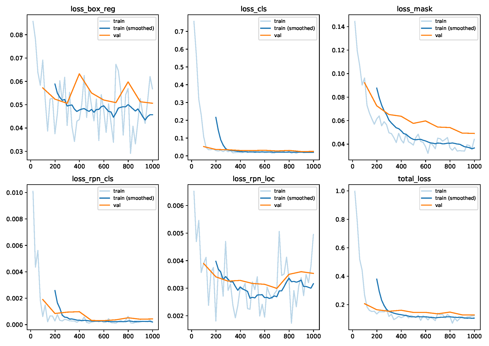
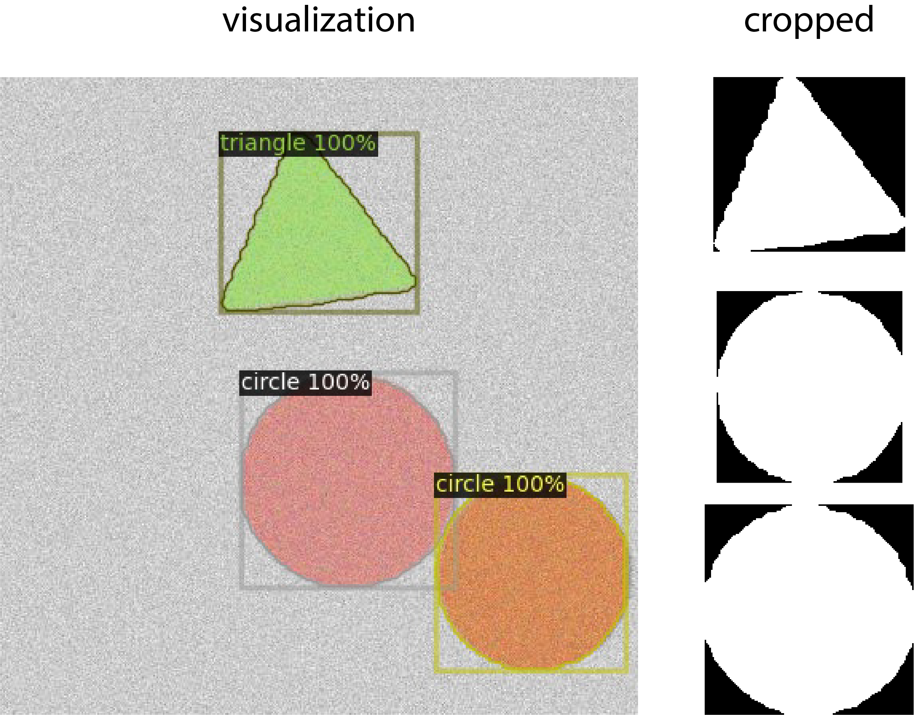
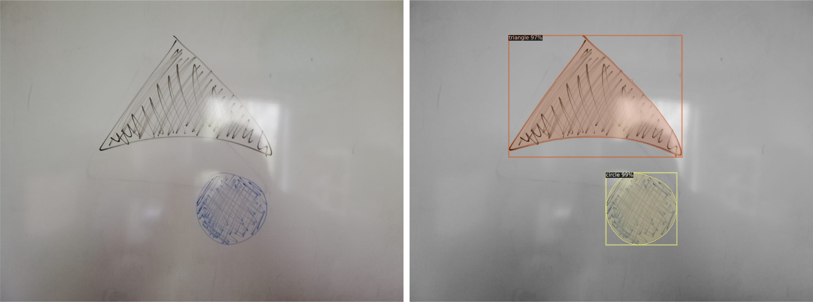

.. _3-getting_started:

Getting Started
===============

Considering an annotated dataset is available, the general GinJinn2 workflow consists of

#.  train(-validation)-test split of the dataset
#.  GinJinn2 project intialization
#.  Project configuration
#.  Model training
#.  Model evaluation
#.  Model application (prediction)

In the following sections this workflow will be illustrated using a simulated dataset.

Preparation
-----------

First, make sure that GinJinn2 is installed (:doc:`install instructions <1-installation>`) and can be called from the terminal:

.. code-block:: bash

    ginjinn -h

Simulation
----------

GinJinn2 ships with a simple dataset simulation utility.
The ``ginjinn simulate shapes`` command generates a dataset in `COCO <https://cocodataset.org/#format-data>`_ or `PASCAL VOC <http://host.robots.ox.ac.uk/pascal/VOC/>`_ format, comprising images with several triangles and circles.
As usual, you can get the list of possible arguments by executing ``ginjinn simulate shapes -h``.

For testing purposes, we will simulate a dataset called "shapes_ds" (``-o shapes_ds``) with 200 (``-n 200``) COCO-annotated (``-a COCO``) images:

.. code-block:: bash

    ginjinn simulate shapes \
        -o shapes_ds \
        -n 200 \
        -a COCO

The previous command will create a new folder "shapes_ds" in your current working directory.
Inside this folder, there is an "images" directory and an "annotations.json" file.
The "images" folder contains the simulated images;
"annotations.json" stores the corresponding instance-segmentation annotations in COCO format.

You can use ``ginjinn info -a shapes_ds/annotations.json`` to display dataset statistics like the number of images and instances per category.

**optional**: You can visualize annotations using the ``ginjinn utils vis`` command.
The following command generates instance-segmentation visualizations (``-v segmentation``) for the simulated dataset (``-a shapes_ds/annotations.json``) in a new folder "shapes_ds_vis" (``-o shapes_ds_vis``).

.. code-block:: bash

    ginjinn utils vis \
        -a shapes_ds/annotations.json \
        -o shapes_ds_vis \
        -v segmentation

Since we now have an annotated dataset, we can get started with the GinJinn2 workflow.

1. Train-Validation-Test Split
------------------------------

Splitting datasets into training, validation (sometimes also called "development"), and test datasets is a common practice when working with predictive machine learning models.
The training set, as the name suggests is used to train a model, while the validation ("development") set is used to evaluate the model quality while tuning hyperparameters like, for example, learning rate, batch size, and so on.
Finally, the test set is used to get an unbiased measure of the model performance, since it is neither used for training nor for hyper parameter tuning.

GinJinn2 provides the ``ginjinn split`` command for splitting datasets COCO and PASCAL VOC format.
We will use it to split the simulated data (``-a shapes_ds/annotation.json``) into sub-datasets comprising 60%, 20% (``-v 0.2``), and 20% (``tv 0.2``) of the whole dataset for training, validation and testing of an instance-segmentation (``-d instance-segmentation``) model.
The splits will be written to a new folder "shapes_ds_split" (``-o shapes_ds_split``).
GinJinn2 implements an heuristic for generating those splits, which tries to equally distribute instance from different categories.
Thus, when executing the following command, you will be asked, whether you want to accept the proposed split, or try again.

.. code-block:: bash

    ginjinn split \
        -a shapes_ds/annotations.json \
        -o shapes_ds_split \
        -d instance-segmentation \
        -v 0.2 \
        -t 0.2

After executing the above command, a new folder "shapes_ds_split" will be created, containing the three subfolders "train", "val", and "test".
The subfolders will each contain a subset of the images and corresponding annotations of the whole dataset.

2. GinJinn2 Project Initialization
----------------------------------

A GinJinn2 project is simply a folder containing a "ginjinn_config.yaml" file and an "outputs" folder.
The "ginjinn_config.yaml" file describes the project configuration, including data, model, training and augmentation specifications.
The "outputs" folder will contains intermediary outputs that are generated while the model is trained.
Those include, for example, training and validation metrics, model checkpoints and `TensorBoard <https://www.tensorflow.org/tensorboard>`_-compatible outputs.

The ``ginjinn new`` command takes care of initializing a new GinJinn2 project.
``ginjinn new`` expects the name of a project directory to be generated, and optionally the path to a dataset folder (``-d``), and the name of a model template (``-t``).
We will use ``ginjinn new`` to generate a new project "shapes_project" for instance segmentation with an Mask R-CNN (``-t mask_rcnn_R_50_FPN_1x.yaml``) using the split shapes dataset (``-d shapes_ds_split``).

.. code-block:: bash

    ginjinn new shapes_project -t mask_rcnn_R_50_FPN_1x.yaml -d shapes_ds_split/

After running the above command, there will a new folder "shapes_project". This folder contains the configuration file "ginjinn_config.yaml" and the empty "ouputs" folder.

3. GinJinn2 Project Configuration
---------------------------------

In this section, we will only very briefly touch the project configuration options, for a more in-depth discussion of the possible options please refer to the project configuration document.

When opening the "ginjinn_config.yaml" file with a text editor (we recommend one with syntax highlighting for YAML files, e.g. `VSCode <https://code.visualstudio.com/>`_), you can see that that the ``input`` section is already filled with the paths to the "shapes_ds_split" datasets, and the ``model`` is set to "mask_rcnn_R_50_FPN_1x".
For this demonstration, we will only modify some training options:

* ``max_iter``: total number of training steps
* ``eval_period``: number of steps between validation data set evaluations
* ``checkpoint_period``: number of steps between saving model checkpoints

We will set those values to ``max_iter: 1000``, ``eval_period: 100``, ``checkpoint_period: 500``.
The ``training`` section of your "ginjinn_config.yaml" should now look like this:

.. code-block:: YAML

    training:
        learning_rate: 0.00125
        batch_size: 1
        max_iter: 1000
        eval_period: 100
        checkpoint_period: 500

The GinJinn2 project is now ready for training.

4. Model Training
-----------------

The model can now be trained by simply running ``ginjinn train`` with the corresponding GinJinn2 project directory.
For our "shapes_project" that is

.. code-block:: bash

    ginjinn train shapes_project

After calling the above command, you will see commandline output describing the model, dataset, and a little bit later the training progress and the evaluation of the validation dataset.
Additionally, the outputs folder will start becoming populated by several files.

"metrics.pdf", "metrics.json", and "events.out.*" are probably the most informative files while the model is training.
"metrics.pdf" contains plots of several performance metrics considering the training and validation datasets.
"metrics.json" contains the same information JSON format.
"events.out.*" is a file that can be read by the `TensorBoard <https://www.tensorflow.org/tensorboard>`_ application for a similar purpose.
Here is an example how "metrics.pdf" might look like after training:

After training, the "model_final.pth" file contains the final model weights, i.e. the trained model.
Additionally, there are model checkpoint files, identified by the "model\_" prefix and ".pth" suffix, storing the model state at certain numbers of training iterations.

5. Model Evaluation
-------------------

Once the model is trained, it can be evaluated using the test dataset.
For this purpose, GinJinn2 provides the ``ginjinn evaluate`` command.
We evaluate our shape detection model using:

.. code-block:: bash

    ginjinn evaluate shapes_project

This will output the evaluation metrics to the console and write an "evaluation.csv" file to the project directory.
Finally, you should compare the evaluation metrics of the validation set (see "metrics.pdf" or "metrics.json") with those of test set to check for overfitting.
In the case of out shapes_project, "segm/AP" in the last line of "metrics.json" should be around 90;
the same should be the case for the "segm"-"AP" entry in "evaluation.csv".

For our shapes project everything should look fine and we can start applying the trained model to new data.

6. Model Application
--------------------

A model can be applied using the ``ginjinn predict`` command.
This command requires a GinJinn2 project with a trained model and a folder containing images (``-i``) to apply the model to.
By default, the predictions are written to the folder "predictions" within the project directory;
another output folder can be used by setting the ``-o`` option.

Let's predict instance-segmentations for the shapes test dataset.
The ``-s`` option allows to control which kind of prediction output should be generated.
By default, a COCO annotation (JSON) file containing the segmentation and/or bounding-box predictions will be generated.
For this example application, we will activate the visualization (``-s visualization``) and cropped (``-s cropped``) output options.

The following command predicts the instance-segmentation for the test dataset and writes outputs to "shapes_prediction".

.. code-block:: bash

    ginjinn predict \
        shapes_project \
        -i shapes_ds_split/test/images/ \
        -o shapes_prediction \
        -s COCO \
        -s cropped \
        -s visualization

The predictions in visualization and cropped format will look similar to this:

Real Data
^^^^^^^^^

Of course, we can not only predict on images from the test dataset, but on any kind of image.
Here is an example with an input image of shapes drawn on a whiteboard, captured with a smartphone camera:

The command to generate the above predication was

.. code-block:: bash

    ginjinn predict \
        shapes_project \
        -i test_images/ \
        -o test_images_pred \
        -s COCO \
        -s cropped \
        -s visualization \
        -r

Conclusion
----------

We have applied GinJinn2 for instance-segmentation of simulated data.
If you want to see how GinJinn2 can be used for object detection and instance segmentation with empirical data, have a look at the :doc:`Empirical Applications <4-empirical_applications>` document.

For information on GinJinn2 project configurations see :doc:`Project Configuration <5-project_configuration>`.