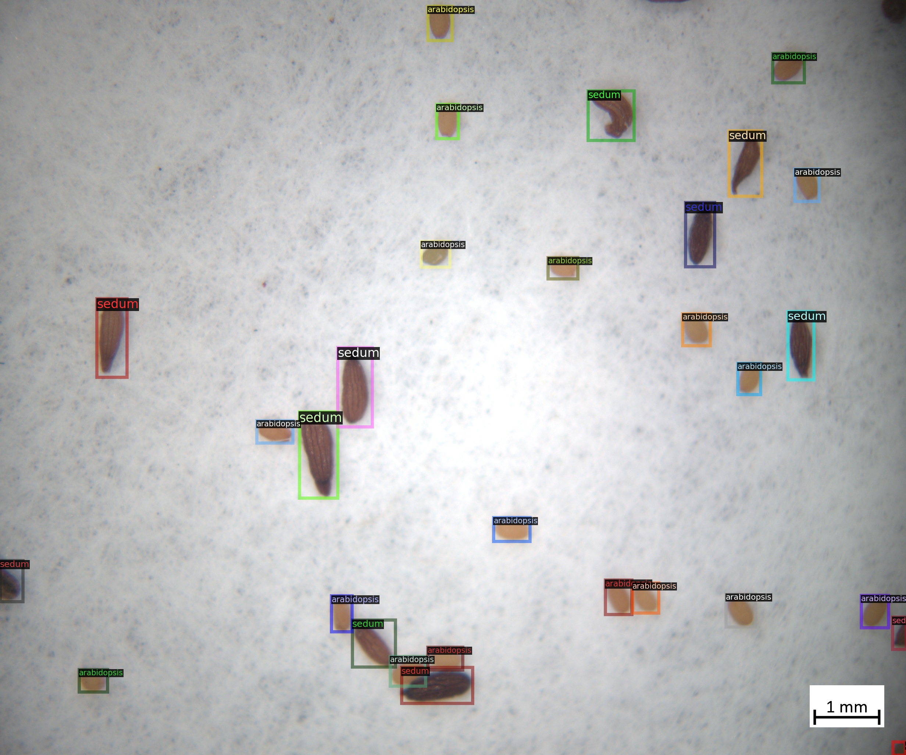

.. _4-example_applications:

Example Applications
====================

In the following, we will explore the application of GinJinn2 for the automatic detection of structures in several different epirical contexts.

The Seeds Dataset
-----------------

The seeds dataset comprises microscopic images of sand-contaminated seed mixtures of the plant genera *Sedum* and *Arabidopsis*.
The seeds are annotated with bounding-boxes, determining the genus membership.
Such a dataset might be analyzed for quality control purposes, i.e. if the composition of a seed mixture is as expected.
In the following, we will train a model to automatically detect seeds, determine the genus, finally determine the seed mixture composition using GinJinn2.

An example image with overlayed annotation:

Data preparation
^^^^^^^^^^^^^^^^

First the dataset must be downloaded and prepared to be used as an input for GinJinn2.

1. Download the data:
   
   The dataset in COCO format is available from GFBio at `not yet available <#>`_.
   
   Download from the commandline:

   .. code-block:: BASH

        wget DOWNLOAD_LINK

2. Flatten the COCO dataset:
   
   GinJinn2 expects all images to be placed directly in the folder :code:`images` within the dataset folder an as a sibling of the annotations (:code:`annotations.json` for COCO or :code:`annotaitons` folder for Pascal-VOC).
   To transform any valid COCO dataset into a flat COCO dataset, GinJinn2 provides the :code:`ginjinn utils flatten` command.

   To flatten the seeds dataset:

   .. code-block:: BASH

        ginjinn utils flatten -i PATH_TO_SEEDS_DS -o seeds_flat

3. Train-Validation-Test split:

   It is a good practice in Machine Learning (ML) to split the dataset into sub-datasets for training, validation, and testing.
   This is necessary to be able to assess the performance of a trained ML on unseen data.
   The general idea is to use the training dataset for model training, and the validation (sometimes called "development") dataset for hyper-parameter tuning, and finally the test dataset as a proxy for real-world performance of the model.
   For this purpose, GinJinn2 provides the :code:`ginjinn split` command.
   This command uses a heuristic to stratify the split on the object level.

   To split the seeds dataset into train (60%), test (20%), and validation (20%):

   .. code-block:: BASH

        ginjinn split -a seeds_flat/annotations.json -o seeds_split -d bbox-detection -t 0.2 -v 0.2

Now the dataset is ready to be used for modeling with GinJinn2.

Model fitting
^^^^^^^^^^^^^

1. Generate new GinJinn2 project:

   First, we need to generate new GinJinn2 project using the :code:`ginjinn new` command.
   You can provide a model template (:code:`-t`), and a data directory (:code:`-d`) to this command.
   Here, we will use a Faster R-CNN as detection model, and the previously generated split dataset as data directory.

   .. code-block:: BASH

        ginjinn new seeds_project -t faster_rcnn_R_101_FPN_3x.yaml -d seeds_split
    
   This will create the folder :code:`seeds_project`, containing a :code:`ginjinn_config.yaml` configuration file and an :code:`outputs` folder for modeling outputs.

2. Modify project configuration:
   
   Now, we will modify the number of training iterations, the evaluation period, and the checkpointing period.
   Additionally, we will add several data augmentation options.
   Augmentations are somewhat random data transformations (e.g. rotation, contrast adaption, ...) that are applied to the images and annotations prior to training.
   By applying these transformations, the dataset is artifically enlarged and made more variable, which very often leads to better model performance on new data.

   In :code:`ginjinn_config.yaml` we will set the entries:

   .. code-block:: YAML

        # ...
        training:
            # ...
            max_iter: 7000
            eval_period: 250
            checkpoint_period: 1000
        # ...
        augmentation:
           - horizontal_flip:
               probability: 0.25
           - vertical_flip:
               probability: 0.25
           - brightness:
               brightness_min: 0.8
               brightness_max: 1.2
               probability: 0.25
           - contrast:
               contrast_min: 0.8
               contrast_max: 1.2
               probability: 0.25
           - saturation:
               saturation_min: 0.8
               saturation_max: 1.2
               probability: 0.25
           - rotation_range:
               angle_min: -30
               angle_max: 30
               expand: True
               probability: 0.25
    
   The project is now ready for training.

3. Train and validate model

   Model training is started via:

   .. code-block:: BASH

        ginjinn train seeds_project

   While the model is running, several files will be generated in the :code:`seeds_project/outputs` directory.
   The file :code:`seeds_project/outputs/metrics.pdf` will contain training and validation dataset metrics, like losses and mAPs, and can be used to monitor the training progress.

4. Evaluate trained model

   After training, the model can be evaluated using the test dataset by calling the :code:`ginjinn evaluate` command:

   .. code-block:: BASH

        ginjinn evaluate seeds_project

   This will write the evaluation output to :code:`seeds_project/evaluation.csv`.
   If there is a large discrepancy between the final validation metrics (see :code:`seeds_project/outputs/metrics.pdf` or :code:`metrics.json`) and the evluation output, there is most likely a problem with the model.

Prediction and counting
^^^^^^^^^^^^^^^^^^^^^^^

New, we can use the trained model to predict bounding-boxes and genus on new data.
As stand-in for new data, we will use the previously generated test dataset.
The :code:`ginjinn predict` command is used for this purpose.
We will also turn on the visualization option (:code:`-s visualization`) , the get a visual representation of the prediction.

.. code-block:: BASH

    ginjinn predict seeds_project -i seeds_split/test/images -o seeds_test_prediction -s visualization 

This will generate a COCO dataset at :code:`seeds_test_prediction`.
This dataset can be used as an input for all other GinJinn2 commands expecting COCO input.
The visualizations are written to :code:`seeds_test_prediction/visualization`.

Finally, we will use the :code:`ginjinn utils count` command to count the number of seeds per genus for each image:

.. code-block:: BASH

    ginjinn count -a seeds_test_prediction/annotations.json -o seeds_test_prediction/counts.csv

This will write the image-wise seed counts per species to the CSV file :code:`seeds_test_prediction/counts.csv`.
Based on this file, the proportion of seeds can be calculated using any tool with CSV-reading capability (e.g. EXCEL, R, Python, ...).

The Yellow-Stickytraps Dataset
------------------------------

The Yellow-Stickytraps dataset comprises images of yellow glue traps that were set in greenhouses.
Three categories of insects are annotated with bounding boxes: Whiteflies (WF), *Nesidiocoris* (NC), and *Macrolophus* (MC).
The task will be to automate the counting of insects per category.
Such an automation can be useful for evaluating the effectiveness of pest control measures.

The Yellow-Stickytraps dataset has some potentially problematic properties:

1) the objects (insects) are very small compared to the image size
2) the bounding box annotations are relatively loose
3) the contrast of the background to the insects is relatively low

We will use GinJinn to solve problem 1) by splitting the original images into sliding windows, which will be used as input
for a bounding-box model.
Problems 2) and 3) can be solved by a more careful annotation sheme and image preprocessing, respectively.
Those, however, will not be discussed in this section.

In the following, we will train a model to automatically detect, categorize, and count insects.

An example image with overlayed annotation:

.. image:: images/yellow-stickytraps_ann_0.jpg
    :alt: Yellow-Stickytraps image with bounding-box annotations.

The *Leucanthemum* Dataset
--------------------------

TODO

An example image with overlayed annotation (original images are color images, the image is shown in grayscale to emphasize the annotations):

.. image:: images/leucanthemum_ann_0.jpg
    :alt: Leucanthemum image with instance-segmentation annotations.

