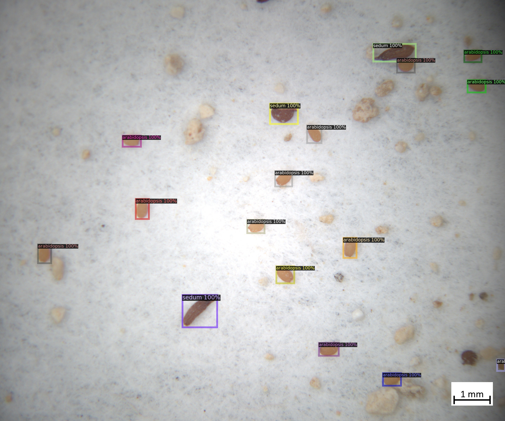
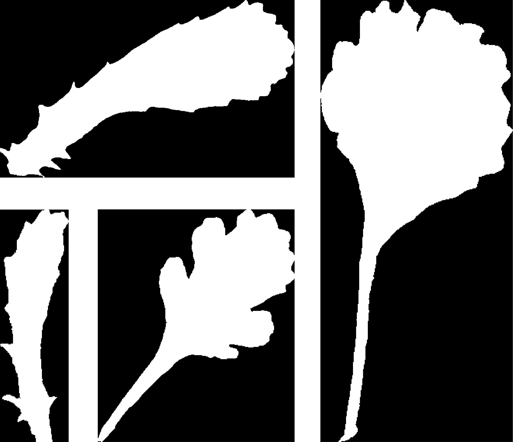

.. _4-example_applications:

Example Applications
====================

In the following, we will explore how GinJinn2 can be applied to automatically detect structures in several empirical contexts.

Seed Counting
-------------

The seeds dataset comprises microscopic images of sand-contaminated seed mixtures of the plant genera *Sedum* and *Arabidopsis*.
The seeds are annotated with bounding-boxes and labeled according to their genus membership.
Such a dataset might be analyzed for quality control purposes, i.e., to assess if the composition of a commercial seed mixture is as expected.
Another possible scenario is the analysis of ecological samples such as seeds collected with seed traps.
In the following, we will train a model to automatically detect seeds and determine their genus, and finally quantify the composition of seed mixtures.

An example image overlaid with object annotations:

.. image:: images/seeds_ann_0.jpg
    :alt: Seed image with bounding-box annotations.

Data preparation
^^^^^^^^^^^^^^^^

First the dataset must be downloaded and prepared to be used as an input for GinJinn2.

1. Download the data:
   
   The dataset in COCO format is available from GFBio at `not yet available <#>`_.
   
   Download from the commandline:

   .. code-block:: BASH

        wget DOWNLOAD_LINK

2. Flatten the COCO dataset:
   
   GinJinn2 expects all images to be placed directly in the folder :code:`images` within the dataset folder, being sibling of the annotations (:code:`annotations.json` for COCO or :code:`annotations` folder for Pascal-VOC).
   To transform any valid COCO dataset into a flat COCO dataset, GinJinn2 provides the :code:`ginjinn utils flatten` command.

   Flatten the seeds dataset:

   .. code-block:: BASH

        ginjinn utils flatten -i PATH_TO_SEEDS_DS/images -a PATH_TO_SEEDS_DS/annotations.json -o seeds_flat

3. Train-Validation-Test split:

   It is a good practice in Machine Learning (ML) to split the available labeled data into sub-datasets for training, validation, and testing.
   This enables to assess the performance of a trained ML model on unseen data.
   The general idea is to use the training dataset for model training, the validation (sometimes called "development") dataset for hyper-parameter tuning, and, finally, the test dataset as a proxy for the real-world performance of the model.
   For this purpose, GinJinn2 provides the :code:`ginjinn split` command.
   This command uses a heuristic to generate sub-datasets whose object occurrences aim to be representative for the original dataset.

   Split the dataset into sub-datasets for training (60%), test (20%), and validation (20%):

   .. code-block:: BASH

        ginjinn split -I seeds_flat -o seeds_split -d bbox-detection -t 0.2 -v 0.2

Now the dataset is ready to be used for model training.

Model fitting
^^^^^^^^^^^^^

1. Generate new GinJinn2 project:

   First, we need to generate a new GinJinn2 project using the :code:`ginjinn new` command.
   You can provide a model template (:code:`-t`), and a data directory (:code:`-d`) to this command.
   Here, we will use a Faster R-CNN as detection model, and the previously generated split dataset as data directory.

   .. code-block:: BASH

        ginjinn new seeds_project -t faster_rcnn_R_101_FPN_3x.yaml -d seeds_split
    
   This will create the folder :code:`seeds_project`, containing a :code:`ginjinn_config.yaml` file and an :code:`outputs` folder.

2. Modify project configuration:
   
   Now, we will modify the number of training iterations, the evaluation period, and the checkpointing period.
   Additionally, we will add several optional data augmentations.
   These are randomized data transformations (e.g. varying rotation, contrast, etc.) that are applied to the images and annotations prior to their use for model training.
   In this way, the dataset is artificially enlarged and made more variable, which very often leads to better model performance on new data.

   In :code:`ginjinn_config.yaml` we will set the entries:

   .. code-block:: YAML

        # ...
        training:
            # ...
            max_iter: 7000
            eval_period: 250
            checkpoint_period: 1000
        # ...
        augmentation:
           - horizontal_flip:
               probability: 0.25
           - vertical_flip:
               probability: 0.25
           - brightness:
               brightness_min: 0.8
               brightness_max: 1.2
               probability: 0.25
           - contrast:
               contrast_min: 0.8
               contrast_max: 1.2
               probability: 0.25
           - saturation:
               saturation_min: 0.8
               saturation_max: 1.2
               probability: 0.25
           - rotation_range:
               angle_min: -30
               angle_max: 30
               expand: True
               probability: 0.25
    
   The project is now ready for training.

3. Train and validate model:

   Model training is started via

   .. code-block:: BASH

        ginjinn train seeds_project

   While this command is running, several files will be generated in the :code:`seeds_project/outputs` directory.
   The periodically updated file :code:`seeds_project/outputs/metrics.pdf` will contain various metrics (e.g. losses, AP) referring to the training or validation dataset and can be used to monitor the training progress.

4. Evaluate trained model:

   After training, the model can be evaluated using the test dataset by executing the command

   .. code-block:: BASH

        ginjinn evaluate seeds_project

   This will write the evaluation output to :code:`seeds_project/evaluation.csv`.
   If there is a large discrepancy between the final validation metrics (see :code:`seeds_project/outputs/metrics.pdf` or :code:`metrics.json`) and the evaluation output, there is most likely a problem with the model.

Prediction and counting
^^^^^^^^^^^^^^^^^^^^^^^

Now, we can use the trained model to predict bounding-boxes enclosing seeds and their respective genus for new image data.
As stand-in for new data, we will use the previously generated test dataset as input to the :code:`ginjinn predict` command.
We will also turn on the visualization option (:code:`-v`) to get a visual representation of the predictions.

.. code-block:: BASH

    ginjinn predict seeds_project -i seeds_split/test/images -o seeds_test_prediction -v

This will generate a COCO dataset named :code:`seeds_test_prediction`.
This dataset can be used as an input for all other GinJinn2 commands supporting COCO input.
The visualizations are written to :code:`seeds_test_prediction/visualization`.

The visualization of the predictions will look similar to this:

Finally, we will use the :code:`ginjinn utils count` command to count the number of seeds per genus for each image:

.. code-block:: BASH

    ginjinn utils count -a seeds_test_prediction/annotations.json -o seeds_test_prediction/counts.csv

This will write the image-wise seed counts to :code:`seeds_test_prediction/counts.csv`.
Based on this file, the proportion of seeds from both genera can be calculated using any tool with CSV-reading capability (e.g. EXCEL, R, Python, ...).

Insect Monitoring using Glue Traps
----------------------------------

The Yellow-Stickytraps dataset comprises images of yellow glue traps placed in greenhouses.
Three categories of insects are annotated with bounding boxes: Whiteflies (WF), *Nesidiocoris* (NC), and *Macrolophus* (MC).
Our goal is to automate the counting of insects per category.
This may, for example, be useful for evaluating the effectiveness of pest control measures.

The Yellow-Stickytraps dataset has some potentially problematic properties:

1) Objects (insects) are very small compared to the image size.
2) Bounding box annotations are relatively loose.
3) The contrast between background and insects is relatively low.

We will mitigate problem 1) by splitting the original images into sliding windows, which will be used as input for a bounding-box object detection model.
Problems 2) and 3) could be addressed by a more careful annotation scheme and image preprocessing, respectively.
Those, however, will not be discussed in this section.

In the following, we will train a model to automatically detect, categorize, and count insects.

An example image overlaid with object annotations:

General data preparation
^^^^^^^^^^^^^^^^^^^^^^^^

First the dataset must be downloaded and prepared to be used as an input for GinJinn2.

1. Download the data:
   
   The dataset in COCO format is available from GFBio at `not yet available <#>`_.
   
   Download and unzip from the commandline:

   .. code-block:: BASH

        wget DOWNLOAD_LINK
        unzip DATASET.zip

2. Flatten the COCO dataset:

   This makes sure all images are located in the same directory:

   .. code-block:: BASH

        ginjinn utils flatten -i PATH_TO_DATASET/images -a PATH_TO_DATASET/annotations.json -o stickytraps_flat

3. Train-Validation-Test split:

   We split the Yellow-Stickytraps dataset into sub-datasets for training (60%), test (20%), and validation (20%).
   For this dataset, it may be necessary to generate multiple split proposals until the category proportions are sufficiently homogeneous across the sub-datasets.

   .. code-block:: BASH

        ginjinn split -I stickytraps_flat -o stickytraps_split -d bbox-detection -t 0.2 -v 0.2

Sliding-window cropping
^^^^^^^^^^^^^^^^^^^^^^^

We will now apply :ref:`Sliding-Window Cropping <4-toolbox_sw_cropping>` to be able to detect the small insects fixed on relatively large glue traps. 
The following command will split the original images into sliding windows of 1024x1024 pixels in size (:code:`-s 1024`)
with an overlap of 256 pixels (:code:`-p 256`) between neighboring sliding windows.
Annotations that are incomplete after the splitting, i.e. "cut-off" polygons, will be excluded (:code:`-c`).
The sliding-window split should be done in the context of bounding box detection (:code:`-k bbox-detection`).

.. code-block:: BASH

    ginjinn utils sw_split -I stickytraps_split -o stickytraps_split_sw -s 1024 -p 256 -k bbox-detection -c

Model fitting
^^^^^^^^^^^^^
    
1. Generate new GinJinn2 project:

   First, we need to generate a new GinJinn2 project using the :code:`ginjinn new` command.
   You can provide a model template (:code:`-t`) and a data directory (:code:`-d`) to this command.
   Here, we will use a Faster R-CNN as object detection model, and the previously generated split dataset as data directory.
   
   .. code-block:: BASH

        ginjinn new stickytraps_project -t faster_rcnn_R_101_FPN_3x.yaml -d stickytraps_split_sw
   
   This will create the folder :code:`stickytraps_project`, containing a :code:`ginjinn_config.yaml` file and an :code:`outputs` folder.

2. Modify project configuration:
 
   Now, we will modify the number of training iterations, the evaluation period, and the checkpointing period.
   Additionally, we will add several optional data augmentations.
   These are randomized data transformations (e.g. varying rotation, contrast, etc.) that are applied to the images and annotations prior to their use for model training.
   In this way, the dataset is artificially enlarged and made more variable, which very often leads to better model performance on new data.

   In :code:`ginjinn_config.yaml` we will set the entries:

   .. code-block:: YAML

        # ...
        training:
            # ...
            max_iter: 7000
            eval_period: 250
            checkpoint_period: 1000
        # ...
        augmentation:
           - horizontal_flip:
               probability: 0.25
           - vertical_flip:
               probability: 0.25
           - brightness:
               brightness_min: 0.8
               brightness_max: 1.2
               probability: 0.25
           - contrast:
               contrast_min: 0.8
               contrast_max: 1.2
               probability: 0.25
           - saturation:
               saturation_min: 0.8
               saturation_max: 1.2
               probability: 0.25
           - rotation_range:
               angle_min: -30
               angle_max: 30
               expand: True
               probability: 0.25
    
   The project is now ready for training.

3. Train and validate model:

   Model training is started via

   .. code-block:: BASH

      ginjinn train stickytraps_project

   While this command is running, several files will be generated in the :code:`stickytraps_project/outputs` directory.
   The periodically updated file :code:`stickytraps_project/outputs/metrics.pdf` will contain various metrics (e.g. losses, AP) referring to the training or validation dataset and can be used to monitor the training progress.
 

4. Evaluate trained model:

   After training, the model can be evaluated using the test dataset by executing the :code:`ginjinn evaluate` command:

   .. code-block:: BASH

        ginjinn evaluate stickytraps_project

   This will write the evaluation output to :code:`stickytraps_project/evaluation.csv`.
   If there is a large discrepancy between the final validation metrics (see :code:`stickytraps_project/outputs/metrics.pdf` or :code:`metrics.json`) and the evluation output, there is most likely a problem with the model.

Prediction and counting
^^^^^^^^^^^^^^^^^^^^^^^

Now, we can use the trained model to predict bounding boxes and insect categories on new image data.
As stand-in for new data, we will use the previously generated test dataset as input to the :code:`ginjinn predict` command.
We will also turn on the visualization option (:code:`-v`), to get a visual representation of the predictions.

.. code-block:: BASH

    ginjinn predict stickytraps_project -i stickytraps_split_sw/test/images -o stickytraps_test_prediction -v

This will generate a COCO dataset named :code:`stickytraps_test_prediction`, which can be used as an input for all other GinJinn2 commands supporting COCO input.
The visualizations are written to :code:`stickytraps_test_prediction/visualization`.

Before we can count the insects, we first need to remove duplicated objects.
Duplications occur when an object is present in two or more sliding windows and successfully detected in more than one of them.
We will use :code:`ginjinn utils sw_merge` to combine the predictions for sliding windows as this will automatically remove duplicate predictions.
The following command merges the sliding-window images (:code:`-i stickytraps_split/test/images`) and annotations (:code:`-a stickytraps_test_prediction/annotations.json`),
and writes the merged images and annotations to :code:`stickytraps_test_prediction_merged` (:code:`-o`).

.. code-block:: BASH

    ginjinn utils sw_merge -i stickytraps_split_sw/test/images -a stickytraps_test_prediction/annotations.json -o stickytraps_test_prediction_merged -t bbox-detection

If you want to have a look at the predictions, the results can be visualized using :code:`ginjinn vis -I stickytraps_test_prediction_merged -v bbox`.

The visualization of the predictions based on the sliding windows will look similar to this:

Now that duplicate predictions are removed, we can count the insects:

.. code-block:: BASH

    ginjinn utils count -a stickytraps_test_prediction_merged/annotations.json -o stickytraps_test_prediction_merged/counts.csv

This will write the image-wise insects counts to :code:`stickytraps_test_prediction_merged/counts.csv`, which can be processed using any tool with CSV-reading capability (e.g. EXCEL, R, Python, ...).

*Leucanthemum* Leaf Segmentation
--------------------------------

The *Leucanthemum* dataset comprises digital images of herbarium specimens from 12 *Leucanthemum* species.
There is only one object category "leaf", which denotes intact leaves that might be used to quantify leaf shape for, e.g., geometric morphometrics.
To be able to train a segmentation model for pixel perfect detection, the leaves are annotated using polygons.

An example image with overlayed annotation (original images are color images, the image is shown in grayscale to emphasize the annotations):

.. image:: images/leucanthemum_ann_0.jpg
    :alt: Leucanthemum image with instance-segmentation annotations.

For this dataset, we will build a pipeline to facilitate automatic feature extraction from digitized herbarium specimens.
Similar to the Yellow-Stickytrap dataset, there are some potential problems concerning the data:

1) the objects (leaves) are small in relation to the image size
2) the images are very large (~4000x6000 pixels)
3) the objects (leaves) are very variable (basal vs. apical leaves) 

Problem 3) could potentially be solved by subdiving the leaf category into subcategories for, e.g., apical, intermediate, and basal leaves.
This, however, would potentially required a larger amount of training data to account for the now smaller number of samples per category.
We will concentrate on solving problems 1) and 2) by applying a custom pipeline consisting of two models:
The first model, from now on called BBox Model, will be trained to detect the bounding boxes of intact leaves in sliding-window crops of the original images.
The second model, from now on called Segmentation Model (Seg. Model), will segment the leaves within the bounding boxes.

The pipeline will look like this:

Data preparation
^^^^^^^^^^^^^^^^

First the dataset must be downloaded and prepared to be used as an input for GinJinn2.

1. Download the data:
   
   The dataset in COCO format is available from GFBio at `not yet available <#>`_.
   
   Download and unzip from the commandline:

   .. code-block:: BASH

        wget DOWNLOAD_LINK
        unzip DATASET_PATH

2. Flatten the COCO dataset:
   
   GinJinn2 expects all images to be placed directly in the folder :code:`images` within the dataset folder an as a sibling of the annotations (:code:`annotations.json` for COCO or :code:`annotaitons` folder for Pascal-VOC).
   To transform any valid COCO dataset into a flat COCO dataset, GinJinn2 provides the :code:`ginjinn utils flatten` command.

   To flatten the *Leucanthemum* dataset:

   .. code-block:: BASH

        ginjinn utils flatten -i DATASET_PATH/images -a DATASET_PATH/annotations.json -o leucanthemum_flat

3. Train-Validation-Test split:

   It is a good practice in Machine Learning (ML) to split the dataset into sub-datasets for training, validation, and testing.
   This is necessary to be able to assess the performance of a trained ML on unseen data.
   The general idea is to use the training dataset for model training, and the validation (sometimes called "development") dataset for hyper-parameter tuning, and finally the test dataset as a proxy for real-world performance of the model.
   For this purpose, GinJinn2 provides the :code:`ginjinn split` command.
   This command uses a heuristic to stratify the split on the object level.

   To split the *Leucanthemum* dataset into train (60%), test (20%), and validation (20%):

   .. code-block:: BASH

        ginjinn split -I leucanthemum_flat -o leucanthemum_split -d instance-segmentation -t 0.2 -v 0.2

Bounding Box Model
^^^^^^^^^^^^^^^^^^

Sliding window splitting
""""""""""""""""""""""""

Similar to the Yellow-Stickytraps analysis, we will split the dataset into sliding windows.
This time, however, we will use larger windows (:code:`-s 2048`) with a larger overlap (:code:`-p 512`):

.. code-block:: BASH

    ginjinn utils sw_split -I leucanthemum_split -o leucanthemum_split_sw -s 2048 -p 512 -c

The sliding windows will be used to train the detection model.

Model training
""""""""""""""

1. Generate new GinJinn2 project:

   .. code-block:: BASH

      ginjinn new leucanthemum_bbox -t faster_rcnn_R_101_FPN_3x.yaml -d leucanthemum_split_sw
  
2. Modify project configuration:

   In :code:`leucanthemum_bbox/ginjinn_config.yaml` we will set the entries:

   .. code-block:: YAML

      # ...
      training:
          # ...
          max_iter: 5000
          eval_period: 250
          checkpoint_period: 2500
      # ...
      augmentation:
         - horizontal_flip:
             probability: 0.25
         - vertical_flip:
             probability: 0.25
         - brightness:
             brightness_min: 0.8
             brightness_max: 1.2
             probability: 0.25
         - contrast:
             contrast_min: 0.8
             contrast_max: 1.2
             probability: 0.25
         - saturation:
             saturation_min: 0.8
             saturation_max: 1.2
             probability: 0.25
         - rotation_range:
             angle_min: -30
             angle_max: 30
             expand: True
             probability: 0.25
  
3. Train and validate model

   Model training is started via:

   .. code-block:: BASH

      ginjinn train leucanthemum_bbox

   While the model is running, several files will be generated in the :code:`leucanthemum_bbox/outputs` directory.
   The file :code:`leucanthemum_bbox/outputs/metrics.pdf` will contain training and validation dataset metrics, like losses and mAPs, and can be used to monitor the training progress.

4. Evaluate trained model

   .. code-block:: BASH

      ginjinn evaluate leucanthemum_bbox

   This will write the evaluation output to :code:`leucanthemum_bbox/evaluation.csv`.
   If there is a large discrepancy between the final validation metrics (see :code:`leucanthemum_bbox/outputs/metrics.pdf` or :code:`metrics.json`) and the evaluation output, there is most likely a problem with the model.

5. (Optional) Prediction, merging, visualization.

   See :code:`ginjinn predict`, :code:`ginjinn utils sw_merge`, :code:`ginjinn visualize` documentation, or Yellow-Stickytraps.

Segmentation Model
^^^^^^^^^^^^^^^^^^

Bounding box cropping
"""""""""""""""""""""

To train a model to extract leaves pixel perfectly from leaf bounding boxes, we will need to process the *Leucanthemum* dataset.
Ginjinn provides the :code:`ginjinn utils crop` command, which crops bounding boxes or polygons from annotated images, and generates a new annotation referring to
the cropped images.
The cropped images can then be used for model training.
Here, we will crop the leaf bounding boxes with a border (padding) of 25 pixels (:code:`-p 25`) to account for some variation in the bounding boxes.

.. code-block:: BASH
    
    ginjinn utils crop -I leucanthemum_split -o leucanthemum_split_cropped -p 25 -t segmentation

Model training
""""""""""""""

1. Generate new GinJinn2 project:

   .. code-block:: BASH

        ginjinn new leucanthemum_seg -t mask_rcnn_R_101_FPN_3x.yaml -d leucanthemum_split_cropped
  
2. Modify project configuration:

   In :code:`leucanthemum_seg/ginjinn_config.yaml` we will set the entries:

   .. code-block:: YAML

      # ...
      training:
          # ...
          max_iter: 5000
          eval_period: 250
          checkpoint_period: 2500
      # ...
      augmentation:
         - horizontal_flip:
             probability: 0.25
         - vertical_flip:
             probability: 0.25
         - brightness:
             brightness_min: 0.8
             brightness_max: 1.2
             probability: 0.25
         - contrast:
             contrast_min: 0.8
             contrast_max: 1.2
             probability: 0.25
         - saturation:
             saturation_min: 0.8
             saturation_max: 1.2
             probability: 0.25
         - rotation_range:
             angle_min: -30
             angle_max: 30
             expand: True
             probability: 0.25

3. Train and validate model

   Model training is started via:

   .. code-block:: BASH

      ginjinn train leucanthemum_seg

   While the model is running, several files will be generated in the :code:`leucanthemum_seg/outputs` directory.
   The file :code:`leucanthemum_seg/outputs/metrics.pdf` will contain training and validation dataset metrics, like losses and mAPs, and can be used to monitor the training progress.

4. Evaluate trained model

   .. code-block:: BASH

      ginjinn evaluate leucanthemum_seg

   This will write the evaluation output to :code:`leucanthemum_seg/evaluation.csv`.
   If there is a large discrepancy between the final validation metrics (see :code:`leucanthemum_seg/outputs/metrics.pdf` or :code:`metrics.json`) and the evaluation output, there is most likely a problem with the model.

5. (Optional) Predict and visualize

   We might be interested in how the model predictions look like:

   .. code-block:: BASH

      ginjinn predict leucanthemum_seg -i leucanthemum_split_cropped/test/images -o leucanthemum_seg_test_prediction -v -c

   The predictions will probably not look very convincing right now.
   To improve the segmentations, we can make use of the segmentation refinement option (:code:`-r`) of the :code:`ginjinn predict` command.
   This will use CascadePSP for improving the segmentations.
   This refinement is only possible, when object borders are relatively pronounced.

   .. code-block:: BASH

      ginjinn predict leucanthemum_seg -i leucanthemum_split_cropped/test/images -o leucanthemum_seg_test_prediction_refined -v -c -r

   The new predictions should look much better.
   
   Visualizations of the predictions might look like this:

   .. image:: images/leucanthemum_seg_pred_0.png
        :alt: Visualization of the Leucanthemum segmentation prediction without and with refinement.
        :width: 400
        :align: center

Making predictions
^^^^^^^^^^^^^^^^^^

With both models trained, we can now run the leaf extraction pipeline.
To predict on new data, the following steps are required:

1) Split new images into sliding windows
2) Predict from BBox Model to get leaf bounding boxes
3) Predict from Seg. Model on bounding boxes

For demonstration purposes, we will pretend that the test images are newly collected images.

.. code-block:: BASH

    cp -r leucanthemum_split/test/images new_images

First, the new images need to be split into sliding windows.
Size (:code:`-s 2048`) and overlap (:code:`-p 512`) should be same as for the training data.

.. code-block:: BASH
    
    ginjinn utils sw_split -i new_images -o new_data_sw -s 2048 -p 512

Now, we predict the bounding boxes of the leaves using the BBox Model.
We will also add some padding (:code:`-p 25`), since we did the same when cropping the training images for Seg. Model.

.. code-block:: BASH
    
    ginjinn predict leucanthemum_bbox -i new_data_sw -o new_data_sw_pred -v -c -p 25

Finally, we can use the cropped bounding boxes as input for the Seg. Model.

.. code-block:: BASH
    
    ginjinn predict leucanthemum_seg -i new_data_sw_pred/images_cropped/ -o new_data_seg_pred -v -c -r

The predicted leaf masks (:code:`new_data_seg_pred/masks_cropped`) can now be used to, for example, quantify the leaf shape using geometrics morphometrics.

The masks should look like this:

